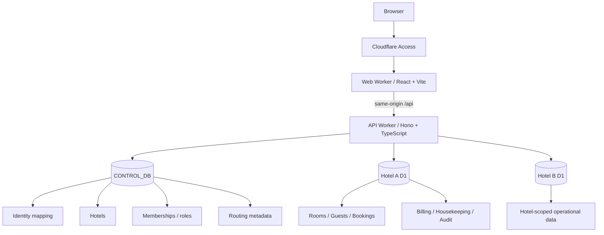

# HMS Cloudflare

[](https://github.com/sjo1848/hms-cloudflare/actions/workflows/ci.yml)

A cloud-native **Hotel Management System (HMS)** migrated to Cloudflare while preserving the behavior and domain rules of an existing hotel product.

The project covers much more than CRUD: reception lifecycle, room inventory, guests, housekeeping, maintenance, billing, reporting, RBAC, multi-hotel administration, migration safety and operational recovery.

> **Goal:** move an accepted HMS from a traditional server/database architecture to Cloudflare Workers + D1 without silently changing the product contract.

---

## Why this project exists

The original HMS already modeled a real hotel workflow. The challenge here is not to rewrite it from scratch, but to perform a **parity-first brownfield migration**:

- preserve observable product behavior;
- preserve domain and authorization semantics;
- replace server-centric infrastructure with Cloudflare primitives;
- replace PostgreSQL tenant isolation with an explicit D1 tenant topology;
- prove migrations, failure paths and recovery instead of relying only on happy-path tests;
- keep the system usable on desktop and mobile;
- maintain a low-cost operating target during validation.

Source baseline: [`sjo1848/hotel-management-system`](https://github.com/sjo1848/hotel-management-system)

---

## Product capabilities

### Reception
- reservations and walk-ins;
- guest + room context;
- check-in validation;
- in-stay operations;
- room reassignment;
- extra charges and payments;
- checkout and invoice readback;
- housekeeping handoff.

### Rooms & guests
- room inventory and availability;
- operational room states;
- room holds;
- guest records and booking context;
- maintenance blocking/release flows.

### Housekeeping & maintenance
- dirty → cleaning → clean transitions;
- maintenance open / resolve / release lifecycle;
- state guards that prevent invalid operational transitions.

### Billing & reporting
- charges and payments;
- invoices and settlement;
- revenue and occupancy reporting;
- operational KPIs.

### Administration
- users and hotel memberships;
- RBAC / capability checks;
- tenant-scoped administration;
- network-level administration and KPIs;
- audit records for privileged operations.

---

## Architecture



### Tenant isolation

The active design uses:

**one control-plane D1 + one operational D1 per hotel**.

`CONTROL_DB` contains only cross-hotel control-plane data such as identities, hotels, memberships, roles and routing metadata.

Operational hotel data lives in physically separate D1 databases. Application-level authorization remains mandatory even with physical database separation.

This topology deliberately avoids pretending that cross-D1 writes are atomic transactions. Critical business operations are designed to remain inside a single hotel database whenever atomicity matters.

---

## Stack

| Layer | Technology |
| --- | --- |
| Frontend | React 19, TypeScript, Vite |
| API | Cloudflare Workers, Hono |
| Database | Cloudflare D1 / SQLite |
| Authentication boundary | Cloudflare Access |
| Authorization | HMS RBAC + hotel/network membership |
| JWT verification | `jose` |
| Testing | Vitest + regression scripts + browser/integration journeys |
| Cloudflare tooling | Wrangler 4 |
| CI | GitHub Actions |

---

## Security model

Authentication and application authorization are intentionally separate.

1. **Cloudflare Access** authenticates the person at the edge.
2. The API validates the Access identity.
3. HMS maps that identity to hotel/network memberships and roles.
4. The requested hotel context is authorized.
5. Only then is the corresponding operational D1 used.

Important design properties:

- local-development authentication bypass is explicitly constrained to local development;
- tenant routing is authorization-aware;
- cross-hotel access requires explicit network-level capability;
- privileged changes are auditable;
- a successful database batch is not treated as proof that every guarded mutation actually changed a row;
- API-only evidence does not count as proof of a required browser journey.

---

## Migration strategy

This project follows a **parity-first migration** rather than a feature rewrite.

The implementation was decomposed into bounded increments covering:

1. Cloudflare foundation;
2. source-contract inventory;
3. rooms / guests / booking parity;
4. reception lifecycle;
5. housekeeping and maintenance;
6. billing;
7. security and administration;
8. analytics and reporting;
9. migration + local operational readiness.

Detailed evidence lives under [`docs/`](docs/).

Key documents:

- [Migration Design Package](docs/migration-design-package.md)
- [Source Contract Inventory](docs/source-contract-inventory.md)
- [CF-I09 Local Operational Readiness](docs/cf-i09-local-operational-readiness.md)

---

## Quality and validation

The repository does not use "tests pass" as a synonym for "product is correct".

Validation combines:

- TypeScript type checking;
- unit and integration tests;
- increment-specific regression suites;
- browser journeys;
- migration rehearsal;
- tenant/RBAC/security checks;
- failure-path and concurrency checks;
- backup/restore rehearsal;
- independent review evidence;
- Human Product Acceptance as a separate authority boundary.

GitHub Actions runs the foundation gate on pushes and pull requests:

```bash
npm ci
npm run types:check
npm run check
npm run web:build
npm run wrangler:dry-run
```

The project also contains targeted regression suites for the migration increments.

---

## Run locally

### Requirements

- Node.js 24+
- npm
- `curl`
- `python3`
- `sha256sum`
- `setsid`

Install dependencies:

```bash
npm install
```

Run the basic validation suite:

```bash
npm run check
npm run web:build
npm run wrangler:dry-run
```

### Full local HMS candidate

Reset the deterministic synthetic fixture and start the API + frontend:

```bash
scripts/cf-i09-local-start.sh --reset
```

Local endpoints:

- frontend: `http://127.0.0.1:4174`
- API: `http://127.0.0.1:8787`

Stop the managed local runtime:

```bash
scripts/cf-i09-local-stop.sh
```

Run the integrated technical smoke:

```bash
node scripts/cf-i09-local-smoke.mjs
```

The smoke exercises real Worker + D1 paths across two hotels and restores the deterministic acceptance baseline afterward.

> Local acceptance uses synthetic data only. No Cloudflare account, production secret or real hotel dataset is required for this workflow.

---

## Backup / restore rehearsal

The local operational-readiness workflow includes coordinated backup and restore for the three D1 databases:

```bash
scripts/cf-i09-local-backup-restore-rehearsal.sh
```

The rehearsal:

1. creates a clean baseline;
2. exports the databases;
3. intentionally mutates all three stores;
4. restores the backup;
5. verifies checksums and machine reconciliation;
6. proves the synthetic mutations disappeared.

This is deliberately described as **local recovery evidence**. It is not claimed to prove remote cross-D1 atomic rollback.

---

## Project status

HMS Cloudflare is under active development and validation.

The Cloudflare parity migration has accumulated technical evidence across the major product domains, while UX/mobile and remote Product Acceptance are managed as separate validation work rather than being inferred from backend CI.

For the live execution state, see:

[`/.orchestration/STATUS.json`](.orchestration/STATUS.json)

The repository intentionally distinguishes:

**Technical PASS → Product Acceptance → Production Readiness → Production Release**

A previous state never automatically implies the next one.

---

## Engineering / orchestration approach

This repository is also a practical testbed for an agentic project-execution model.

The project separates:

- **Project Method** — authority, phases, evidence rules, Human Gates and validation semantics;
- **Project Harness** — state files, Task Contracts, learned invariants, CI, evidence, review/rework loops and source-of-truth convergence;
- **Runtime Adapter** — the concrete environment executing the harness;
- **Model** — replaceable reasoning/generation layer.

The important rule is that project state is persisted outside conversational memory. A new runtime should be able to reconstruct the current task, artifact, evidence and next authorized action from durable project sources.

See [`AGENTS.md`](AGENTS.md) and [`.orchestration/`](.orchestration/) for the execution harness.

---

## Cost boundary

The validation architecture targets **Cloudflare Free / approximately $0 monthly infrastructure cost** for this stage.

That is a project constraint, not a promise that every future production workload will fit indefinitely within free-tier capacity. A transition that introduces material recurring cost requires an explicit architecture/product decision instead of silently enabling a paid dependency.

---

## Repository structure

```text
hms-cloudflare/
├── apps/
│   ├── api/                 # Hono API Worker + D1 schemas/migrations
│   └── web/                 # React/Vite frontend + Web Worker
├── docs/                    # design, parity and validation evidence
├── scripts/                 # regression, migration and operational tooling
├── .orchestration/          # project harness, state, contracts and reviews
├── .github/workflows/       # CI
├── AGENTS.md                # runtime/orchestration contract
└── README.md
```

---

## What this repository demonstrates

From an engineering perspective, the project is intended to demonstrate:

- brownfield migration instead of greenfield-only development;
- domain-preserving architecture changes;
- serverless/edge application design;
- tenant isolation and RBAC;
- transactional and concurrency reasoning;
- migration and recovery engineering;
- browser-level product validation;
- CI and evidence-driven delivery;
- explicit separation between automated technical proof and human product judgement.

---

## License

No open-source license has been declared yet. Unless a license is added, the repository should be treated as source-available for review rather than permission to reuse or redistribute the code.
