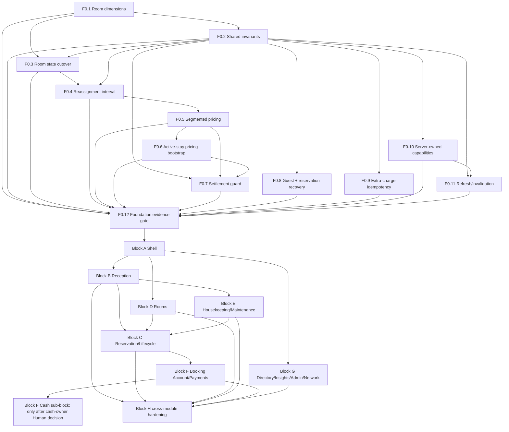

# HMS Cloudflare — Implementation Roadmap Dependency DAG v1

Authority: frozen Blueprint 001, Critic Reconciliation 007, Final Disposition 008. This is a planning graph, not implementation authorization.

## Edges and interpretation

| Edge | Class | Rationale / exit condition |
|---|---|---|
| F0.1 → F0.2 → F0.3 | Hard | Cannot safely backfill/cut over without target dimensions and shared command/state semantics. |
| F0.1/F0.2/F0.3 → F0.4 | Hard | Reassignment interval consumes room truth, shared command rules and mapped state. |
| F0.4 → F0.5 → F0.6 | Hard | Pricing segments use the effective interval; active-stay bootstrap uses the segment model. |
| F0.2/F0.5/F0.6 → F0.7 | Hard | Settlement guard checks the current segmented booking/account truth. |
| F0.2 → F0.8/F0.9/F0.10 | Hard | Shared command identity/error conventions precede recoverable create, charge retry and capability exposure. |
| F0.2/F0.10 → F0.11 | Hard | Authoritative capabilities and shared command outcomes govern refresh/invalidation. |
| F0.1–F0.11 → F0.12 | Hard | Every Foundation item is independently evidenced before aggregate Foundation acceptance. |
| F0.5/F0.7 → F0.9 | None | Charge retry/idempotency is independent of pricing segmentation and checkout settlement guard; D11 charge reconciliation is existing contract context, not a sequencing dependency. |
| F0.12 → A–H | Hard | No block starts until applicable foundation criteria have evidence and are accepted. |
| A → B,D,G | Hard | Shell, context, routes, capability visibility and responsive navigation contracts are shared dependencies. |
| B → C,E,F | Hard | Reception is the operational origin/context for lifecycle, room-care and account tasks. |
| D,E → C | Hard | Lifecycle eligibility depends on room state/readiness/maintenance and inventory truth. |
| C → F | Hard | Booking lifecycle and authoritative booking account context precede booking-linked finance UI. |
| all material A–G → H | Hard | H is integration hardening, not an upstream substitute for per-block QA. |
| D and E after A | Soft parallel | Disjoint feature surfaces; shared room predicates and event contracts must be frozen at F0.1/F0.2. |
| G modules after A | Soft parallel | Guests, Reports, hotel Admin, Network may split by disjoint surfaces; capability/API boundaries are shared. |
| F account/payment and F cash | Soft/conditional | Non-cash account work can proceed; cash portion is independently gated by ownership validation. |

## Parallelism constraints

- One writer per overlapping API/schema/UI surface. Concurrent block work is not permission to alter shared F0 contracts.
- D and E can be planned/implemented in parallel only after room dimension naming, read predicates, event semantics and migration compatibility are frozen.
- Guest/Reports/Admin/Network splits are safe only with one capability authority and route ownership; G integration is still required before H.
- Cash validation is not a blocker for F booking-account, charge or payment tasks; only F-cash waits.
- If any existing-state row cannot map unambiguously during room/pricing bootstrap, quarantine that row/set; do not gate unrelated synthetic/local work, but do gate activation for affected hotels/records.

## Critical path

The longest planned foundation chain is F0.1 → F0.2 → F0.3 → F0.4 → F0.5 → F0.6 → F0.7 → F0.12 → A → B → C → F-account → H. F0.8/F0.9/F0.10 can progress independently after F0.2; F0.11 follows F0.10; every item joins F0.12. D/E join at C. Cash-owner decision only blocks F-cash; F-cash joins H after its conditional gate.

## Recovery on a failed gate

Stop the affected node and descendants only. Preserve accepted upstream artifacts. No rollback of already accepted schema is presumed safe: use forward-compatible additive repair or the node-specific recovery plan. Return to the nearest failed contract/evidence gate; do not bypass a dependency by making a UI-only assumption.
