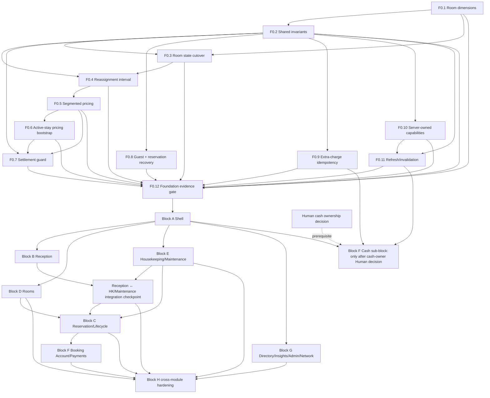

# HMS Cloudflare — Implementation Roadmap Dependency DAG v1

Authority: frozen Blueprint 001, Critic Reconciliation 007, Final Disposition 008. This is a planning graph, not implementation authorization.

## Edges and interpretation

| Edge | Class | Rationale / exit condition |
|---|---|---|
| F0.1 → F0.2 → F0.3 | Hard | Cannot safely backfill/cut over without target dimensions and shared command/state semantics. |
| F0.1/F0.2/F0.3 → F0.4 | Hard | Reassignment interval consumes room truth, shared command rules and mapped state. |
| F0.4 → F0.5 → F0.6 | Hard | Pricing segments use the effective interval; active-stay bootstrap uses the segment model. |
| F0.2/F0.5/F0.6 → F0.7 | Hard | Settlement guard checks the current segmented booking/account truth. |
| F0.2 → F0.8/F0.9/F0.10 | Hard | Shared command identity/error conventions precede recoverable create, charge retry and capability exposure. |
| F0.2/F0.10 → F0.11 | Hard | Authoritative capabilities and shared command outcomes govern refresh/invalidation. |
| F0.1–F0.11 → F0.12 | Hard | Every Foundation item is independently evidenced before aggregate Foundation acceptance. |
| F0.5/F0.7 → F0.9 | None | Charge retry/idempotency is independent of pricing segmentation and checkout settlement guard; D11 charge reconciliation is existing contract context, not a sequencing dependency. |
| F0.12 → A–H | Hard | No block starts until applicable foundation criteria have evidence and are accepted. |
| A → B,D,E,G | Hard | Shell/context contracts precede each module; E does not wait for B implementation. |
| F0.12 + A + F0.1–F0.3/F0.10 → E | Hard start prerequisite | E requires room-state and capability contracts, accepted within Foundation gate. |
| B + E → Reception ↔ HK/Maintenance integration checkpoint → C/H | Hard integration checkpoint | Contextual links and refresh integrate before C consumes both flows and before H acceptance; B does not block E start. |
| B → C | Hard | Reception case context is needed for guided lifecycle tasks. |
| D,E → C | Hard | Lifecycle eligibility depends on room state/readiness/maintenance and inventory truth. |
| C → F-account | Hard | Booking lifecycle and authoritative booking account context precede booking-linked finance UI. |
| A + F0.9/F0.11 + cash-owner decision → F-cash | Hard, conditional | Cash reconciles received payments and is not sequenced after F-account/Receivables UI. |
| all material A–G → H | Hard | H is integration hardening, not an upstream substitute for per-block QA. |
| B, D and E after F0.12 + A | Soft parallel | E additionally needs F0.1–F0.3 and F0.10; it joins B at an integration checkpoint before C/H. |
| G modules after A | Soft parallel | Guests, Reports, hotel Admin, Network may split by disjoint surfaces; capability/API boundaries are shared. |
| F-account and F-cash | Soft/conditional parallel | F-account is Booking/Stay grain; F-cash can proceed independently after its own dependencies and Human ownership decision. |

## Parallelism constraints

- One writer per overlapping API/schema/UI surface. Concurrent block work is not permission to alter shared F0 contracts.
- B, D and E can progress in parallel after F0.12 and A, subject to their own F0 prerequisites; E does not depend on B to start. The B↔E integration checkpoint is required before C consumes both workflows and before H acceptance.
- Guest/Reports/Admin/Network splits are safe only with one capability authority and route ownership; G integration is still required before H.
- Cash validation is not a blocker for F-account, charges or payments; only F-cash waits for the cash-owner decision. F-cash is not downstream of Receivables/F-account UI.
- If any existing-state row cannot map unambiguously during room/pricing bootstrap, quarantine that row/set; do not gate unrelated synthetic/local work, but do gate activation for affected hotels/records.

## Critical path

The longest planned foundation chain is F0.1 → F0.2 → F0.3 → F0.4 → F0.5 → F0.6 → F0.7 → F0.12 → A → (B + E integration checkpoint) → C → F-account → H. B, D and E may progress in parallel after Foundation 0 and A; B is E's integration checkpoint, not its start gate. F0.8/F0.9/F0.10 progress independently after F0.2; F0.11 follows F0.10; every item joins F0.12. F-cash is a separate conditional branch from A plus relevant Foundation contracts and Human cash-owner decision; it is not downstream of F-account/Receivables.

## Recovery on a failed gate

Stop the affected node and descendants only. Preserve accepted upstream artifacts. No rollback of already accepted schema is presumed safe: use forward-compatible additive repair or the node-specific recovery plan. Return to the nearest failed contract/evidence gate; do not bypass a dependency by making a UI-only assumption.
