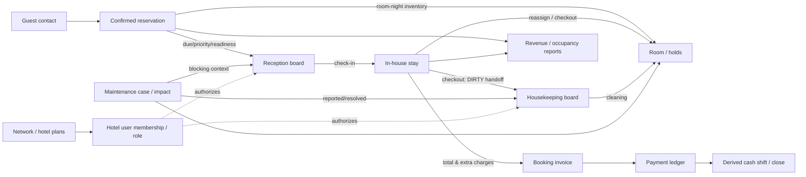

# HMS Hotel Operations Journeys — AS-IS v1

Product baseline: `b9197e278e227a8e3da5ecb867d6d430f69c1d2f`. This map describes current routes/API transitions, not a proposed journey. Steps absent in this baseline are marked `MISSING`; API-only capabilities are not drawn as UI. Stable workflow references are in [the catalog](HMS-SYSTEM-WORKFLOW-CATALOG-V1.md).

## System relation map

Solid edges represent observed source/domain dependencies; dotted edges represent administration/authorization boundaries. A data relationship does not imply a UI navigation link. Every operational page is routed separately; the notable exception is Billing/Cash embedded below Reception.

## Journey A — Reservation to Arrival

`Guest → Reservation → Availability → Room → Arrival Queue → Check-in`

| Step | Module / current action | Shared state | Continuity break / missing step |
|---|---|---|---|
| Find/create guest | Guests page create, or select existing guest inside Reception create form | guest ID/contact | Separate Guests creation means return to Reception and reselect; no inline create-with-booking command found |
| Select dates/room | Reception form → availability search | booking dates, room-night inventory, room rate | Price total not shown before submit; availability and physical status are separate facts |
| Create reservation | Reception POST booking | booking/guest/room/inventory | Queue reload; no separate booking detail route used |
| Triage arrival | Reception authoritative board; q/lane filters | booking state, hotel-local date, room/maintenance readiness | Most filters remain in component/URL only for Reception; newly created future case may not remain selected |
| Verify/check in | Focused task; checklist/count; ready/blocker/advisory | booking + physical room state | Current check-in is integrated. Late-arrival recording and no-show transition are absent; “late arrival” queue reason is not an ETA capture form |
| Recover/finish | 409 refresh stays in task; successful authoritative refresh selects next filtered case | current board/room state | Integrated evidence exists for selected local fixture/viewport, not all roles or device classes |

Status: `RES-01/02 UI_COMPLETE`, `REC-01..05 UI_COMPLETE/PARTIAL`, `REC-06/07 MISSING`. See E-REC/E-CHECK/E-BOOK/E-LIFE.

## Journey B — In-house Stay

`Checked-in guest → Room → Charges/Payments → Reassignment / Stay Changes → Maintenance interactions`

| Step | Module / current action | Shared state | Continuity break / missing step |
|---|---|---|---|
| Locate stay | Reception in-house lane; Rooms and Guests also derive context | checked-in booking, room | Room/Guest detail shows stay but has no link into Reception booking |
| Read room | Rooms page current physical status/context | room status, holds, bookings | Current room context comes from limited booking list/browser date, not same authoritative front-desk read model |
| Charge/payment | Billing panel below Reception, independent booking select | invoice, extra charges, immutable ledger | Queue selection does not propagate; Payment panel’s booking can differ from selected guest |
| Reassign | Selected checked-in Reception detail, inline room/reason/pricing form | remaining room-nights, destination, invoice D11 | Current UI computes stay pricing across booking’s full nights; eligibility query covers full interval while backend applies remaining nights. Difference merits runtime diagnosis; not claimed observed failing case |
| Extend stay | No in-house extension action | would change interval/inventory/price | V11 command expected but absent in audited baseline; confirmed reservation date edit is different |
| Maintenance | Housekeeping embeds maintenance case; Reception reads destination/current context | impact, physical status, future reservations | NON_BLOCKING create/escalate not available in UI; no maintenance-specific affected reservation review workspace |

Status: `STAY-01 UI_COMPLETE`, `STAY-02/04 UI_PARTIAL`, `STAY-03 MISSING`, `PAY/ACC` split status in catalog. See E-REC/E-HOOK/E-LIFE/E-BILLUI/E-HKAPI and V11-07.

## Journey C — Departure

`In-house → Account review → Checkout → Room Dirty → Housekeeping`

| Step | Module / current action | Shared state | Continuity break / missing step |
|---|---|---|---|
| Select departing booking | Reception departure/in-house queue | guest, room, checkout date | Existing inline checkout is attached to selected case |
| Review account | Operator must separately scroll to Billing and choose booking | invoice/charges/payments/remaining | Checkout’s `charge_reviewed` is a confirmation checkbox; account information is not embedded and selector is independent |
| Choose checkout policy | Reception checkout form; settled vs pending-approved + reference | policy/evidence | Selecting settled is not itself payment; `/settle-payment` has no UI caller |
| Confirm checkout | Backend requires charge review, room release, HK handoff; status CHECKED_OUT | lifecycle event, room status | UI submits command and reloads; no prior account selection coupling |
| Physical handoff | Room becomes DIRTY and appears in HK board | room physical status | Open BLOCKING case interplay after occupied-room checkout is a source-derived concern, not browser-reproduced (F-12) |

See E-REC/E-LIFE/E-BILLUI/E-BILLAPI/E-HKAPI. No checkout mutation run during discovery.

## Journey D — Room Turnaround

`Checkout → Dirty → Cleaning → Available → next arrival`

| Step | Module / current action | Shared state | Continuity break / missing step |
|---|---|---|---|
| Checkout handoff | Reception checkout sets room DIRTY; board reload is separate from HK route | booking ends; physical room dirty | No direct navigate/transfer to selected housekeeping task |
| Find work | HK date queue/search/filter + next task | hotel-local board date, departure context | Date initializes from URL but later changes not written back; search/filter/selection local |
| Start/finish | HK actions DIRTY→CLEANING→AVAILABLE | physical readiness | Finish advances to next actionable visible task; mobile selected detail uses custom role=dialog article |
| Next arrival | Reception board independently checks readiness | booking inventory + room readiness/maintenance | Operator leaves HK and re-triages Reception; no shared task navigation |

Status: `HK-01..04 UI_COMPLETE`, `HK-05 UI_PARTIAL`; E-HK/E-HKAPI/E-BOARD.

## Journey E — Maintenance

`Issue → Maintenance Case → BLOCKING/NON_BLOCKING → operational impact → resolution → room return`

| Step | Module / current action | Shared state | Continuity break / missing step |
|---|---|---|---|
| Report issue | Housekeeping room task creates open case | reason, priority, owner, impact, audit | UI sends impact BLOCKING unconditionally; backend accepts both values |
| Apply impact | Backend reconciles room state/sellability; Reception/room/HK read different slices | open one-per-room case; occupied can stay OCCUPIED under blocker | Case impact is absent from ordinary HK summary; no dedicated case history/list |
| Existing future booking | Board/read model can expose blocker context; no automatic cancellation/move | future reservation remains confirmed; human decision | No dedicated affected-booking remediation surface is evidenced; target V11 specifies attention semantics |
| Escalate/resolve | API supports escalation note and canonical resolve; UI has no escalation, resolves via legacy dirty alias | case identity, note, real room state | Resolution label describes DIRTY; UI does not surface all state-preserving implications |

No guest is automatically moved by observed API. Status: `MAINT-02 UI_COMPLETE` only for blocking create; `MAINT-03/04 BACKEND_ONLY`, `MAINT-05/06 PARTIAL`, `MAINT-07 UNCERTAIN`. See E-HK/E-HKAPI/E-MAINT/V11-07.

## Journey F — Financial

`Booking → Charge → Invoice → Payment → Remaining Balance`

| Step | Module / current action | Shared state | Continuity break / missing step |
|---|---|---|---|
| Price booking | Reception create/edit; checked-in reassign reprices | booking total, extra charges, invoice | No distinct guest-wide folio; booking is financial grain |
| Add charge | Billing booking selector then description/cents | extra charge + D11 invoice reconciliation | Category fixed OTHER; displayed history omits metadata |
| Read invoice | Billing selected booking | amount, paid, remaining, status; backend derives credit | No invoice portfolio UI; ordinary summary omits credit |
| Record payment | Billing amount/method/ref/note; operation token | immutable payment entries and paid ledger total | Payment history UI omits returned time/ref/receiver; settle-payment command has no UI action |
| Read remaining | Refresh invoice panel | D11 remaining/credit/status | Cross-surface cash balance does not refresh automatically after payment |

Cash closure is a separate journey below, not the invoice. No refund/credit-consumption operation inferred. See E-BILLUI/E-BILLAPI and D11 historical evidence.

## Journey G — Reception Shift

`Payments during shift → cash/non-cash balance → count → difference → handoff → close shift`

| Step | Module / current action | Shared state | Continuity break / missing step |
|---|---|---|---|
| Payment received | Booking-selected Billing panel | payment ledger entries | Panel is a lower Reception section with independent booking selector and state |
| Read shift-like total | CashBalancePanel reads derived totals since prior close/first payment | cash/noncash/count/pending/opening timestamp | No explicit shift-opening or assigned cashier session command found; “opening” derived |
| Count/handoff | Same cash form; expected cash read-only; counted cents/handoff/notes | snapshot of payments | Distinct form from booking payment, but on same long page |
| Close | Backend rechecks aggregate and creates closure; UI reports difference and refreshes balance | closure row, actor, totals, opening/closing | History endpoint exists, no UI; stale payment panel not automatically linked to close panel; conflict error may require refresh |

Status: `SHIFT-01/02 UI_COMPLETE` for current balance/close; `SHIFT-03 BACKEND_ONLY`; explicit shift-opening expectation remains product question (`SHIFT-04`). E-BILLUI/E-BILLAPI.

## Cross-journey discontinuities

1. Resource identifiers connect domains in API/database, while module-local selection and lack of links force manual context reconstruction.
2. Booking selection has no shared propagation into invoice/payment/cash panels.
3. Room physical state, reservation sellability/holds, maintenance impact and HK task status are related but are not a single UI state; compact room badge/count terminology can differ.
4. Checkout→HK and HK→Reception are separate navigation/refresh steps.
5. Reported revenue is booking total by arrival date; cash is payment-entry sum since a derived/closed boundary. The two figures answer different questions.
6. Hotel-local board dates coexist with browser-local guest/room context and browser-derived Reports/Network ranges.
7. Some current APIs cover more operation modes/history than human UI exposes; other future-contract operations are absent entirely. Neither class alone establishes product priority.

## Evidence limits

The journey map combines source code, migrations and V11 target contract references. It does not assert a newly executed end-to-end mutation. Historical integrated check-in and reassignment evidence is linked from the main audit and remains bounded to its fixtures/flows. Local discovery browser navigation was read-only, covered seven routes at 1280/820/390, and encountered one Worker exit/restart and Network 403. See `docs/ux/evidence/discovery-browser-observations.md`.
